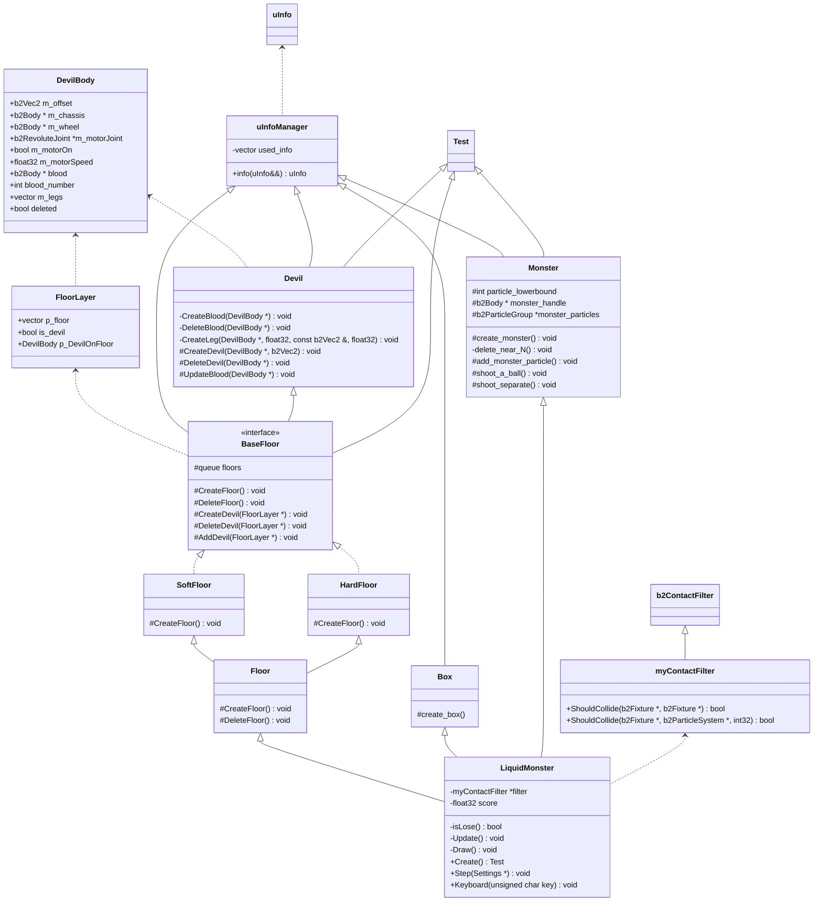

# OOP 大作业——Liquid Monster 文档

[TOC]

## 概况

玩家在游戏中操纵一个流体怪物，需要在一个滚动下降的无尽高塔中向下逃脱，并且不能被界顶端的突刺刺中，也不能掉落太快从下方掉出画面。

玩家的游戏目标是最大化获得的分数。分数有两种获得方式，一是按时间，与大小相关增长，二是通过打魔鬼的的获得。

游戏中，有两种材质的地面，分别是坚硬，柔软的地面。

### 游玩方法

玩家主体在游戏开始时为球形小怪物，在逃脱高塔的过程中会遇到妖怪。流体怪物可以通过发射流体/粒子炮弹击打魔鬼，若击打成功杀死妖怪，则给予分数奖励。此外，根据玩家操控的流体怪物的大小，会有相应的得分bonus。如果怪物受到界面顶端的突刺的伤害，粒子则会消失,当粒子数量达到某个下界之后,游戏将会结束。

玩家通过键盘控制流体怪物。wasd分别代表上左下右，玩家会控制一个小球作为“手柄”。q键射出小球, e键射出流体.

## 组员及分工

陈启乾 2020012385 Box Monster 类实现

吴斯媛 2020011706 Floor Devil 类实现

git仓库地址: https://git.tsinghua.edu.cn/cqqthu20/liquidmonster

## 实现

我们基于 liquidfun 的 Tests 类进行我们的开发。

以下是我们的 UML 类图：(在 typora 中打开可以看到, 或者生成 mermaid 图表亦可)

所有继承均为虚继承，保证仅有唯一的 Test 基类.

### 主要类解说

#### Floor 类

Floor 类主要负责在游戏界面上生成地板.

Floor类由两个类组成, 分别是 hardfloor 和 softfloor, 代表两种不同材质的地面.

这两个类又派生自一个共同的虚基类 basefloor.

`CreateFloor` 在图上画出一个 Floor 及其附带的 Devil

`DeleteFloor` 在图上删除一个 Floor 及其附带的 Devil

#### Devil 类

Devil 类主要用于在 floor 上面生成一个 devil. Devil 类被 BaseFloor 类继承. Devil 其实主要是作为一个接口类在使用.

Devil 上面有一个血条, 是每五个回合更新一次位置, 速度, 角速度跟随 devil 本体的.

Devil 包含不止一个 body, 为了检测对于 devil 的攻击, 这里利用了userinfo, 将这些 body 的 userinfo 的指针全都指向 devilbody, 然后调用 devilbody 的 DeleteDevil 即可.

`CreateDevil` 是创建一个 devil 及其血条 .

`DeleteDevil` 是删除一个 devil 及其血条 .

`UpdateDevil` 是更新一个 devil 的血条.

#### Box 类 

Box 类是游戏界面外围的背景，包括上面的刺，下面的坡道以及周围的“墙”。

`create_box` 函数在 Test 类中画出 Box。

#### Monster 类

`monster` 类负责怪物的本体. monster 本体由一条红色的 `chain` 和蓝色的 `body` 构成,

`CreateMonster` 函数在 Test 类中画出 Monster.

`shoot_a_ball` 函数和 `shoot_separate` 是 monster 攻击 devil 的方式,分别是一个凝聚的小球和一堆分散的小球.

`add_monster_particle` 函数是随时间增加 monster 粒子的函数.

#### LiquidMonster 类

是程序的主体所在.

`Step` 是处理每一个回合物体和粒子的碰撞.

`Keyboard` 处理键盘输入.

`draw` 输出游戏信息.

## 关于完成任务情况

### collision effect of elastic objects

我们的 monster 可以视作一个 elastic objects，其与 box、hardfloor、 devil 之间的碰撞是 elastic objects 和 rigid bodies 的碰撞；而其与 softfloor 的碰撞可以视作 elastic bodies 之间的碰撞。

### water flow effect

monster 可以射出粒子攻击 devil，当放出的攻击粒子较多时，其可以显现出一种水流效果。